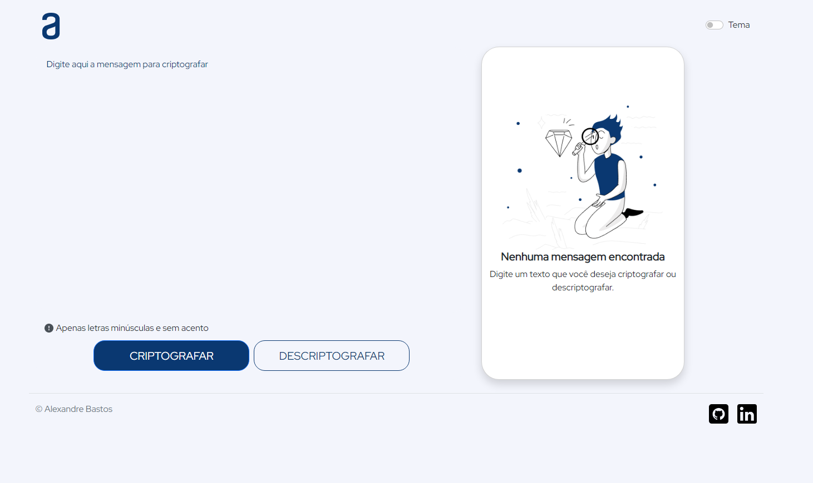
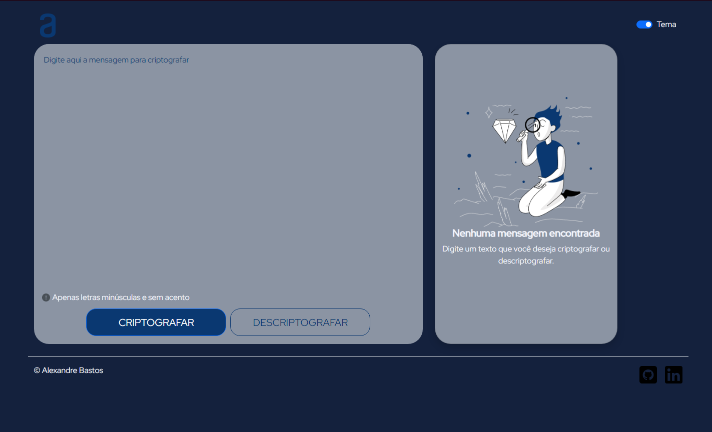

# Codificador - Challenge Programa Oracle ONE
<p>Nesse desafio feito durante a formação da Oracle tive que desenvolver um codificador de texto usando HTML e CSS para construir o layout do projeto e JavaScript para implementar a lógica da criptografia.</p>

### LÓGICA
O método de criptografia empregado no desafio tinha como base substituir vogais por uma sílaba determinada, segue abaixo a relação usada:
```
`A letra "e" é convertida para "enter"`
`A letra "i" é convertida para "imes"`
`A letra "a" é convertida para "ai"`
`A letra "o" é convertida para "ober"`
`A letra "u" é convertida para "ufat"`
```
### LAYOUT
Para desenvolver esse desafio foi fornecido um modelo de layout padrão, cabendo ao aluno a implementação do mesmo.
</img>
**Modelo para Desktop**

</img>
**Resultado final** 

### EXTRAS
Durante o desenvolvimento do projeto me veio a ideia de implementar um modo escuro para a página, abaixo está o resultado final:
</img>

### BADGE DO DESAFIO


Para acessar o meu projeto e experimentar a criptografia <a href="https://xand3.github.io/Codificador-Challenge-Oracle/" target="_blank">acesse aqui.</a>